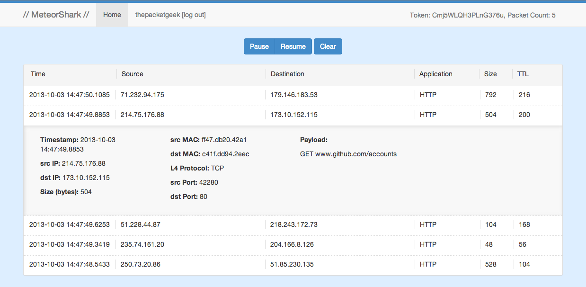

# Packet Sniffing in the Cloud
Sniff packets and view them in the cloud live, what?!?  Yup, this is made possible with Meteorshark & [scapy-to-api](https://www.github.com/thepacketgeek/scapy-to-api "scapy-to-api").

This project came-to-be while I was preparing for a presentation on scapy for people that may not be familiar with Wireshark and viewing packets. I didn't want to lose sight of what I was showing by getting lost in the heavy, detailed packet view of a typical packet analysis program or a cli utility such as tcpdump.

##Usage

### Accessing the interface

Due to the way packets are stored in the MongoDB for account separation, users must have an account so they can insert packets with their own token.  Once installed, go to <http://localhost:3000/> and create an account, or check out a [public instance, hosted by Meteor](http://meteorshark.meteor.com)!

Once logged in, you can see your account Token at the bottom of the main screen.  Use this for the `owner` property in the packet.json explained below.

### Viewing Packets

As the API/DB is populated with packets you will see them appear on the screen. Each packet is expandable for more information (info provided depends on the packet type and protocol support in the client side script). You can pause and resume the packet loading with the buttons on top.  While paused, you can see if you have received more packets by looking at the Packet Count on the bottom of the main screen, next to the token.

### Packet Structure

Packets are inserted, stored, and fetched as individual JSON objects in a MongoDB collection from a client side sniffing script, such as [scapy-to-api](https://www.github.com/thepacketgeek/scapy-to-api "scapy-to-api"). 

Packet JSON properties are as follows:
<pre><code>packet = {
	"timestamp": "",
	"srcIP": "",
	"dstIP": "",
	"L7protocol": "",
	"size": "",
	"ttl": ""
	"srcMAC": "",
	"dstMAC": "",
	"L4protocol": "",
	"srcPort": "",
	"dstPort": "",
	"payload": "",
	"owner": ""
};
</pre></code>

## Installation

1. Install [Node.js](http://nodejs.org/ "Node.js")
1. Install [Meteor](http://www.meteor.com "Meteor")
1. Clone Meteorshark
1. Open terminal and `cd` to `meteorshark`
1. Run `meteor` command
1. Access <http://localhost:3000/>